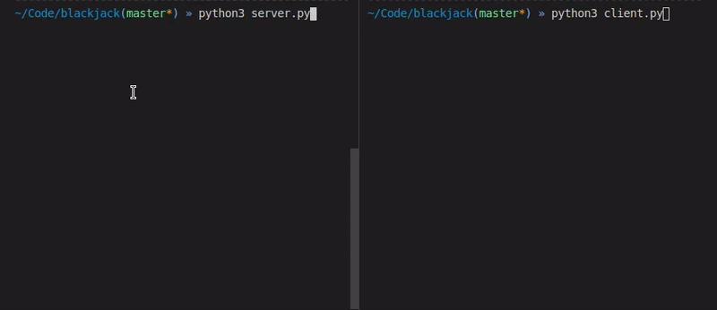
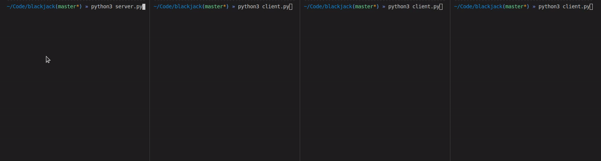

# TCP Blackjack

A simplified version of [Blackjack](https://en.wikipedia.org/wiki/Blackjack). The server/client architecture was developed using TCP sockets, and every simultaneous connection is held by the server in a new process thread.



## Usage

There are two main python scripts:

- `client.py`
- `server.py`

Both may be used in the same way:

```shell
# Defaults to localhost:3000
python3 client.py
python3 server.py

# You may choose a specific host IP and/or port
python3 client.py -i 127.0.0.1 -p 5000
python3 server.py -i 127.0.0.1 -p 5000

# Displays help message
python3 client.py -h
python3 server.py -h
```

After executing the server script, it will bind to the specified host and wait for connection requests. Now, running
the client script will result in a connection attempt. After establishing the socket connection, a game of Blackjack
will start.

One single server may hold many simultaneous connections with clients, each one in it's own new thread.


## The Game

The user running the client application will be able to play against the server, who'll automatically act as a Dealer.
The player might keep playing for as long as he/she desires.

This game is a simplified version of Blackjack. At each round, the player will start buying cards from the deck, and
may keep doing as long as desired, or until exceeding 21 points (causing a loss).

If the player hits exactly 21 points, the round will be automatically registered as a win. If the player has more than 21 points, the round will be lost. Otherwise, the Dealer will start buying cards, until it surpasses the player's score. If the Dealer has more than 21 points, the victory is granted to the player.

The cards are rated as below:

| Type of card         | Value                                             |
| -------------------- | ------------------------------------------------- |
| Ace                  | 1 or 11, depending on what is better to its owner |
| Numbered cards       | The number on the card                            |
| Figures (K, Q and J) | 10                                                |
